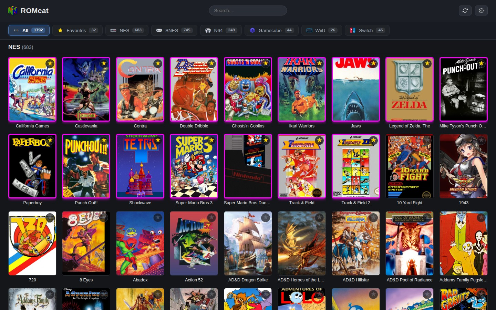

# Nintendo & Retro Emulator Web Catalog (ROM Cat)

[](https://python.org)
[](https://flask.palletsprojects.com/)
[](https://www.steamgriddb.com)
[](https://yaml.org)
[](https://kernel.org)

A fast, lightweight, self-hosted web catalog and remote launcher for your retro and modern ROM collection. It runs locally alongside your installed emulators (Flatpak or native binaries), providing an interactive web dashboard with cover art, system filtering, instant search, favorites tracking, and one-click game launching directly into native desktop emulator windows.

---

## Screenshot



---

## Features

- **Direct Native Emulator Launching**: Games launch in your real desktop emulators (Flatpak, native binaries, or RetroArch cores) on the host machine. No slow or inaccurate in-browser emulation.
- **System Tabs & Live Counters**: Instant switching between systems (e.g. NES, SNES, N64, Gamecube, Wii U, Switch, Favorites, All, Hidden).
- **Fast Search & Filtering**: Real-time title search across thousands of ROMs with automatic title normalization (stripping tags like `[!]`, `(USA)`, `(Rev 1)`, `.nkit`).
- **Automated Cover Art Scraping**: One-click cover fetching from SteamGridDB with automatic image optimization and local caching in `static/covers/`.
- **Manual Cover Art Override**: Drop custom cover art directly into the web UI or filesystem for unmatched or homebrew titles.
- **Favorites & Visibility Management**: Toggle game favorites with custom glowing highlights, or hide unwanted duplicates/updates from the main catalog.
- **Remote & Local Access**: Access the web UI from your desktop browser, phone, tablet, or over a Tailscale / local network while games launch on your main display.
- **Zero Heavy Databases**: Library state is indexed dynamically from your real directory structure, with cached metadata stored in lightweight JSON files.

---

## Quickstart & Installation

### 1. Clone the Repository

```bash
git clone https://github.com/PlasmaDrifter/Emulator-Web-Catelog.git romcat
cd romcat
```

### 2. Create Python Virtual Environment & Install Dependencies

```bash
python3 -m venv venv
source venv/bin/activate
pip install -r requirements.txt
```

Required Python packages:
- `flask`
- `pyyaml`
- `requests`
- `pillow`
- `ujson`

### 3. Configure Systems & SteamGridDB Key

Edit `config.yaml` to point to your ROM directories and configure emulator commands (see detailed instructions below).

### 4. Run the Application

```bash
python3 app.py
```

Open your browser and navigate to:
```text
http://localhost:8420
```
Or use your machine's local IP / Tailscale IP (e.g. `http://<server-ip>:8420`).

---

## How to Edit Emulators and Systems

All emulator execution commands, system definitions, ROM paths, and allowed file extensions are configured inside `config.yaml`.

### Configuration Structure

Each system entry in `config.yaml` is structured under the `systems:` block:

```yaml
systems:
  <system_identifier>:
    name: "Display Name"
    folder: "/path/to/rom/directory/"
    extensions: [".ext1", ".ext2"]
    command: "<command_template> {rom}"
```

### Understanding Parameters

- **`system_identifier`**: Lowercase or camelCase key used internally (e.g. `nes`, `snes`, `n64`, `gamecube`, `wiiu`, `switch`).
- **`name`**: The user-facing name shown in the top navigation tab and header.
- **`folder`**: Path to the ROM directory on your host filesystem. Can be a single directory path or a YAML list of multiple paths:
  ```yaml
  folder:
    - "/path/to/primary/roms/WiiU/"
    - "/path/to/secondary/storage/WiiU/"
  ```
- **`extensions`**: List of file extensions to include in the scan.
- **`command`**: The exact shell command used to start the emulator.
  - `{rom}` is automatically replaced by `app.py` with the full, shell-quoted path to the selected ROM file.
  - Environment variables such as `DISPLAY=:0` and `WAYLAND_DISPLAY=wayland-0` can be prepended if needed.

---

### Emulator Command Examples

#### 1. Flatpak Emulators

If your emulators are installed via Flatpak, use `flatpak run <Application-ID> {rom}`:

| System | Emulator | Command in `config.yaml` |
|---|---|---|
| **NES** | Nestopia | `flatpak run ca._0ldsk00l.Nestopia {rom}` |
| **SNES** | Snes9x | `flatpak run com.snes9x.Snes9x {rom}` |
| **SNES** | BSNES | `flatpak run dev.bsnes.bsnes {rom}` |
| **SNES** | ZSNES | `flatpak run io.github.xyproto.zsnes {rom}` |
| **N64** | Gopher64 | `flatpak run io.github.gopher64.gopher64 {rom}` |
| **N64** | Mupen64Plus | `flatpak run io.github.mupen64plus.mupen64plus-gui {rom}` |
| **GameCube / Wii** | Dolphin | `flatpak run org.DolphinEmu.dolphin-emu {rom}` |
| **Wii U** | Cemu | `flatpak run info.cemu.Cemu -g {rom}` |
| **PlayStation 1** | DuckStation | `flatpak run org.duckstation.DuckStation {rom}` |
| **PlayStation 2** | PCSX2 | `flatpak run net.pcsx2.PCSX2 {rom}` |
| **GBA** | mGBA | `flatpak run io.mgba.mGBA {rom}` |
| **PSP** | PPSSPP | `flatpak run org.ppsspp.PPSSPP {rom}` |

#### 2. Native Binaries & AppImages

For standalone binaries or AppImages located in your system or applications directory:

```yaml
Switch:
  name: "Switch"
  folder: "/path/to/roms/Switch/"
  extensions: [".nsp", ".xci"]
  command: "env DISPLAY=:0 WAYLAND_DISPLAY=wayland-0 /path/to/emulator/binary -g {rom}"
```

#### 3. RetroArch with Libretro Cores

To launch via RetroArch cores directly:

```yaml
snes:
  name: "SNES"
  folder: "/path/to/roms/SNES/"
  extensions: [".sfc", ".smc"]
  command: "retroarch -L /usr/lib/libretro/snes9x_libretro.so {rom}"
```

---

### Adding a New Console / System

To add a new console (for example, Game Boy Advance):

1. Open `config.yaml`.
2. Add a new block under `systems:`:

```yaml
  gba:
    name: "Game Boy Advance"
    folder: "/path/to/roms/GBA/"
    extensions: [".gba", ".zip"]
    command: "flatpak run io.mgba.mGBA {rom}"
```

3. Save `config.yaml`.
4. Click **Rescan library** in the top navigation bar or restart `app.py`. The new tab will appear automatically with game counts.

---

## How to Edit Colors and Theme

All styles, colors, active tabs, buttons, borders, and glow effects are managed in:
`static/css/style.css`

### Color Reference Table

| UI Element | CSS Selector | Default Color | Description |
|---|---|---|---|
| **Main Background** | `body` | `#14161a` | Dark background for the whole page |
| **Primary Text** | `body` | `#e8e8e8` | Base text color |
| **Header Bar** | `header` | `#1c1f26` | Top navigation bar background |
| **System Tabs Bar** | `.tabs` | `#181b21` | Category pill bar background |
| **Borders & Dividers** | `header`, `.tabs`, `h2` | `#2a2e37` | Subtle section divider borders |
| **Button Background** | `button` | `#2a2e37` | Standard button background |
| **Button Border** | `button` | `#3a3f4b` | Standard button border |
| **Button Hover** | `button:hover` | `#343a46` | Button background when hovered |
| **Active Tab Background** | `.tab.active` | `#3a7bd5` | Blue accent on selected system tab |
| **Tab Outline** | `.tab` | `#3a7bd5` | Inactive tab pill border |
| **Search Input Box** | `#searchInput` | `#2a2e37` | Search input background |
| **Search Focus Outline** | `#searchInput:focus` | `#3a7bd5` | Search box glowing highlight |
| **Cover Card Box** | `.cover` | `#22262e` | Default cover background placeholder |
| **Favorite Star (Inactive)** | `.star` | `#5a6270` | Gray inactive favorite star icon |
| **Favorite Star (Hover)** | `.star:hover` | `#d5acd6` | Light magenta star on hover |
| **Favorite Star (Active)** | `.star.active` | `#ff00ff` | Bright magenta star when favorited |
| **Favorite Card Border** | `.card[data-favorite="true"] .cover` | `#ff00ff` | 3px magenta border on favorited cards |
| **Favorite Card Glow** | `.card[data-favorite="true"] .cover` | `rgba(213, 172, 214, 0.4)` | Outer box-shadow glow on favorited cards |
| **Hidden Item Toggle** | `.hide-toggle:hover` | `#e07a7a` | Red outline on hide button hover |

---

### Customizing Key Color Elements

#### 1. Changing the Primary Accent Color (Tabs & Focus)
To change the blue accent color across the tabs and search box, update `#3a7bd5` in `static/css/style.css`:

```css
/* Inactive tab border */
.tab {
  border: 1px solid #3a7bd5; /* Replace with your color */
}

/* Active tab highlight */
.tab.active {
  background: #3a7bd5;     /* Replace with your color */
  border-color: #3a7bd5; /* Replace with your color */
  color: #fff;
}

/* Search bar focus ring */
#searchInput:focus {
  border-color: #3a7bd5;
  box-shadow: 0 0 6px rgba(58, 123, 213, 0.3);
}
```

#### 2. Changing the Favorite Star and Card Glow Color
To change the bright magenta favorite glow to gold, green, cyan, or red, update lines 188-234 in `static/css/style.css`:

```css
/* Star icon active color */
.star.active {
  color: #f1c40f; /* e.g. Gold */
  border-color: #f1c40f;
}

/* Favorite card glowing border */
.card[data-favorite="true"] .cover {
  border: 3px solid #f1c40f;
  box-shadow: 0 0 12px rgba(241, 196, 15, 0.5);
}
```

#### 3. Changing Dark Theme Backgrounds
To adjust darkness levels (e.g. Pure OLED Black `#000000` or Catppuccin Mocha `#1e1e2e`):

```css
body {
  background: #11111b;
  color: #cdd6f4;
}

header {
  background: #181825;
  border-bottom: 1px solid #313244;
}

.tabs {
  background: #181825;
  border-bottom: 1px solid #313244;
}
```

---

## How Cover Art Scraping Works

1. **Automatic Scraping with SteamGridDB**:
   - Register for a free API key at [SteamGridDB API Preferences](https://www.steamgriddb.com/profile/preferences/api).
   - Paste your key into `config.yaml` under `steamgriddb.api_key`.
   - Click **Fetch cover art** in the header.
   - The application automatically strips revision and dump tags (e.g. `(USA)`, `[!]`, `.nkit`), searches SteamGridDB, resizes the image to 300x400 JPG, and saves it to `static/covers/`.
   - Re-running only downloads covers for games that are still missing art.

2. **Manual Cover Art Overrides**:
   - For obscure or homebrew titles, type a custom search term into the cover card's **Find cover** input and click search.
   - Alternatively, drop any image into `static/covers/` using the following naming convention:
     `static/covers/<system>_<rom_stem>.jpg`
     *(Spaces and punctuation in the ROM filename become underscores)*.

---

## Repository File Tree

```text
Emulator-Web-Catelog/
├── README.md                # Full documentation, emulator guides, and color customizations
├── config.yaml              # System definitions, ROM folder paths, and emulator commands
├── app.py                   # Flask server, library scanner, SteamGridDB client, and launcher
├── requirements.txt         # Python dependencies (flask, pyyaml, requests, pillow, ujson)
├── favorites.json           # Saved user favorites list
├── hidden.json              # List of hidden ROM keys (updates, duplicates, DLCs)
├── library.json             # Cached library metadata for instant page load performance
├── .gitignore               # Ignore cache, logs, virtual environments, and scraped covers
├── screenshots/
│   └── catalog.jpg          # Application dashboard screenshot
├── static/
│   ├── favicon.png          # Web browser favicon
│   ├── covers/              # Local cache directory for game boxart
│   │   └── .gitkeep
│   └── css/
│       └── style.css        # CSS styles, theme variables, grid layout, and glow animations
└── templates/
    └── index.html           # Main dashboard template with search, tabs, and launching modal
```

---

## Running as a Background Systemd Service

To keep the web catalog running automatically in the background on boot:

1. Create a user service definition at `~/.config/systemd/user/romcat.service`:

```ini
[Unit]
Description=ROM Cat Emulator Web Catalog
After=network.target

[Service]
Type=simple
WorkingDirectory=%h/romcat
ExecStart=%h/romcat/venv/bin/python3 %h/romcat/app.py
Restart=on-failure
RestartSec=5

[Install]
WantedBy=default.target
```

*(Note: `%h` is a standard systemd specifier that automatically expands to the user's home directory. Adjust `%h/romcat` if your clone is located in another folder).*

2. Enable and start the user service:

```bash
systemctl --user daemon-reload
systemctl --user enable --now romcat.service
```

3. Check service status:

```bash
systemctl --user status romcat.service
```

---

## License

Created and maintained by [PlasmaDrifter](https://github.com/PlasmaDrifter). Distributed for personal and self-hosted use.
